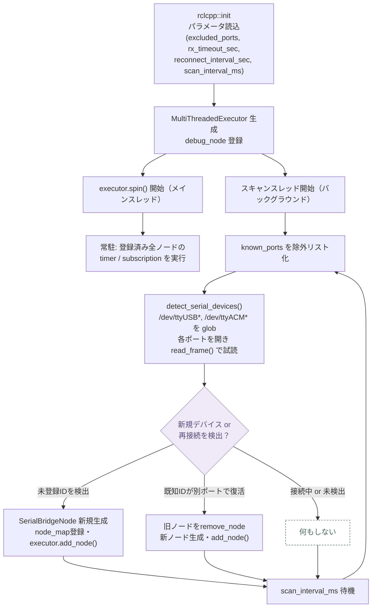
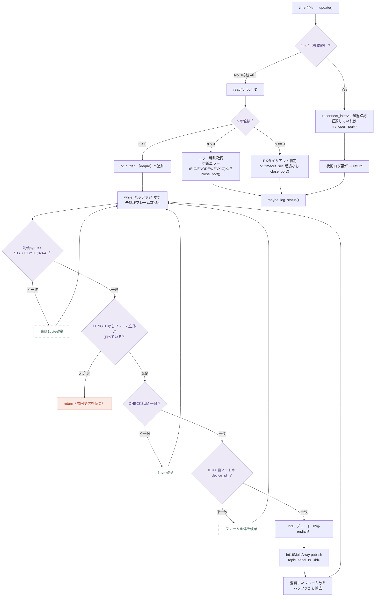
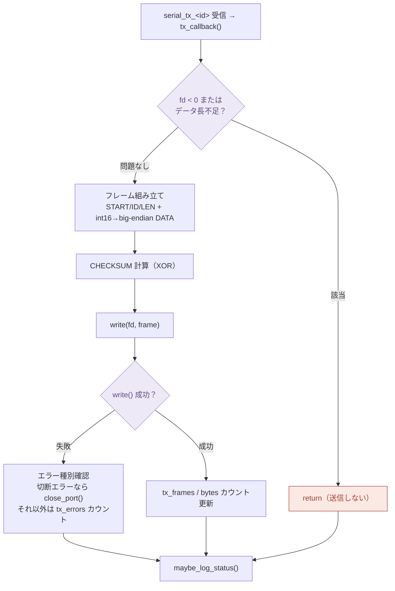
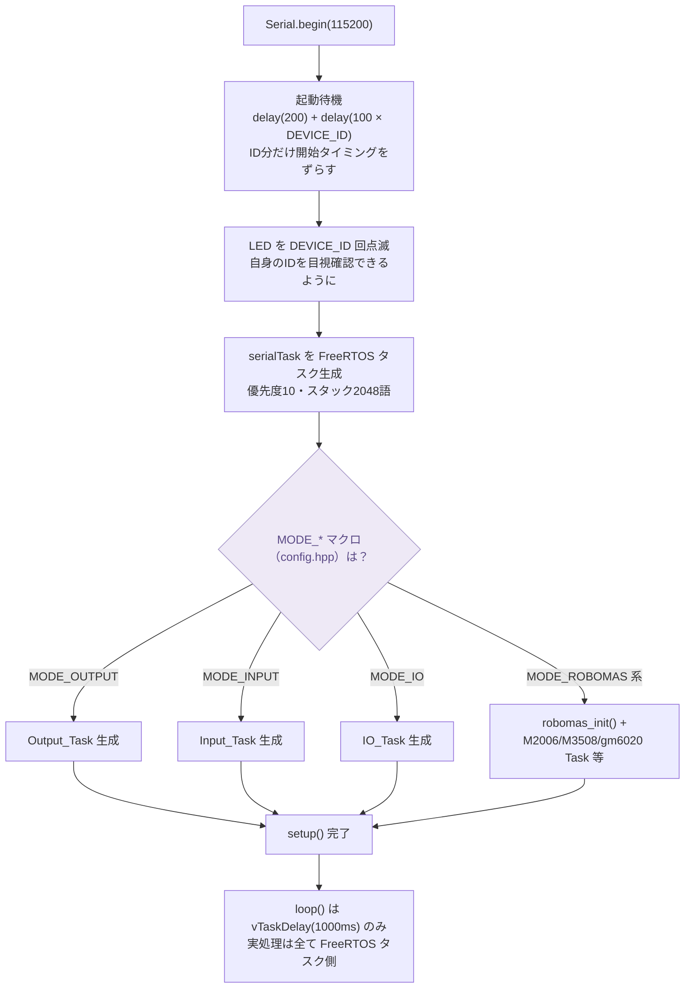
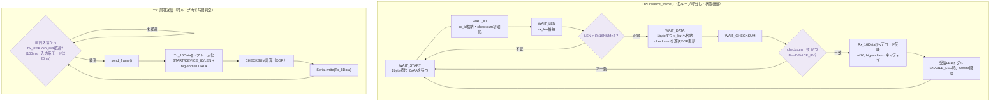
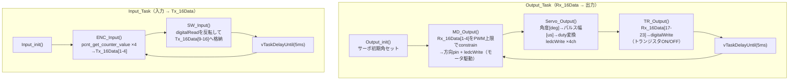

# serial_bridge 処理フローチャート

ROS 2 側（`bridge_node`）とマイコン側（代表例として `firmware/esp32_serial_bridge`）の、シリアルフレーム送受信の処理フローをまとめたもの。
STM32 / Arduino Uno / ESP32 系 / B-G431 等、他ターゲットのファームウェアも同一フレームプロトコルと FreeRTOS タスク構成を踏襲している。

## 共通フレーム構造

ROS 2 側・マイコン側とも同一のバイト列フォーマットを使用する（`bridge_node.cpp` / `serial_task.cpp` 共通仕様）。

| バイト位置 | 名前 | 内容 |
|---|---|---|
| `[0]` | START | `0xAA` 固定 |
| `[1]` | DEVICE ID | 送信元/宛先デバイスID |
| `[2]` | LENGTH | DATA部のバイト数 |
| `[3..]` | DATA | `int16` × N（big-endian、上位byte→下位byte） |
| `[last]` | CHECKSUM | `ID ^ LEN ^ DATA...`（XOR） |

- RX: マイコン → ROS 2（topic: `serial_rx_<id>`）
- TX: ROS 2 → マイコン（topic: `serial_tx_<id>`）

---

## ① ROS 2 側処理（bridge_node パッケージ）

`main.cpp` が起動すると、常駐する「スキャンスレッド」がポートを走査してデバイスを検出し、検出ごとに `SerialBridgeNode`（1デバイス = 1ノード）を動的に生成して `MultiThreadedExecutor` へ登録する。

### 起動〜デバイス検出（`main.cpp` / `port_scanner.cpp`）

### SerialBridgeNode: 受信処理 RX（`bridge_node.cpp` — `update()`）

ノードごとに wall timer で駆動。1バイト単位で START_BYTE 同期を取り、checksum と ID を検証してから ROS トピックに publish する。

### SerialBridgeNode: 送信処理 TX（`bridge_node.cpp` — `tx_callback()`）

`serial_tx_<id>` トピックの subscription コールバックとして駆動（timer ではなくイベント駆動）。

---

## ② マイコン側処理（ESP32 版ファームウェアを代表例）

### setup(): 起動・タスク生成（`main.cpp`）

> `MODE_*` は 1 つのみ定義する必要があり、複数定義・未定義はコンパイルエラーになる。

### serialTask: フレーム送受信（`serial_task.cpp`）

1つの FreeRTOS タスク内で、RX（状態機械によるバイト単位パース）と TX（周期送信）を毎ループ両方処理する。

> `receive_frame()` は毎ループ呼び出され、送信は `TX_PERIOD_MS` 経過判定のうえ `send_frame()` が呼ばれる。両者は同一タスク内で `vTaskDelay(1ms)` を挟みながら繰り返される。

### 制御タスク例: Output_Task / Input_Task（`pin_ctrl_task.cpp`、5ms周期）

serialTask とは独立した FreeRTOS タスクとして動作し、共有配列 `Rx_16Data[]` / `Tx_16Data[]` を介して GPIO と受け渡しする。`MODE_IO` はこの2系統を1タスクにまとめたもの。

`Tx_16Data[]` は serialTask の TX 側がそのまま ROS 2 へ送信し、ROS 2 側が publish する `Rx_16Data[]`（＝ROS 2 から見た TX フレーム）を serialTask の RX 側が受け取って `Output_Task` が参照する — という形で、2つのタスクが共有配列を介して疎結合に連携する。

---

参照ソース: `bridge_node.cpp` / `main.cpp` / `port_scanner.cpp`（ROS 2側）, `firmware/esp32_serial_bridge/src/{main,serial_task,pin_ctrl_task}.cpp`（マイコン側）
